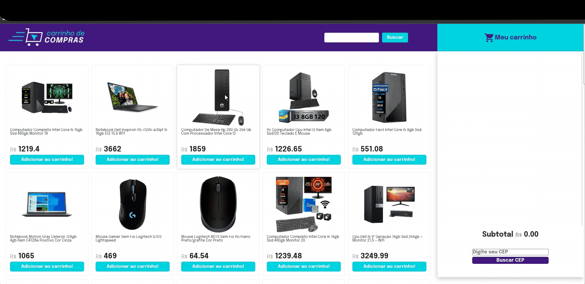

# Projeto Shopping Cart 🛒

Este é um projeto de carrinho de compras desenvolvido em JavaScript, focado na manipulação do DOM para adicionar, remover e gerenciar itens em um carrinho de compras virtual. O projeto tem como objetivo demonstrar habilidades de programação em JavaScript, bem como boas práticas de desenvolvimento de software.

## Funcionalidades Principais

- **Adição de Itens:** Os usuários podem adicionar itens ao carrinho de compras clicando em botões ou interagindo com a interface.
- **Remoção de Itens:** Os usuários podem remover itens do carrinho de compras, seja individualmente ou todos de uma vez.
- **Cálculo do Total:** O projeto realiza automaticamente o cálculo do total da compra com base nos itens adicionados e exibe o valor total ao usuário.

## Tecnologias Utilizadas

- **JavaScript:** Linguagem de programação principal para a lógica do projeto.
- **DOM Manipulation:** Utilização de manipulação do DOM para interatividade com o usuário.
- **Jest:** Framework de teste utilizado para garantir a qualidade e a robustez do código.
- **Vite:** Ferramenta de desenvolvimento rápida para criação de projetos modernos em JavaScript.

## Como Utilizar

1. Clone este repositório para o seu ambiente local.
2. Abra o projeto em seu editor de código favorito.
3. Execute npm install para instalar as dependências do projeto.
4.Execute npm run dev para iniciar o servidor de desenvolvimento.
5. Abra o navegador e acesse http://localhost:3000 para visualizar o projeto.